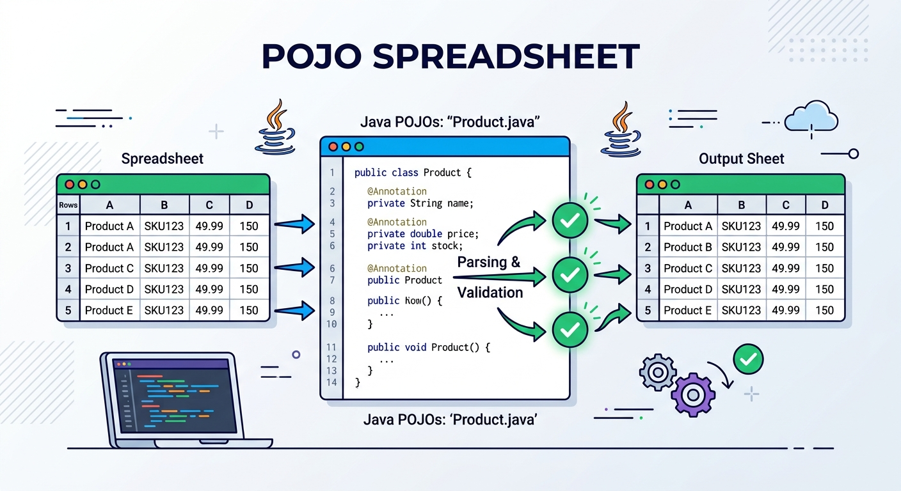

# pojo-spreadsheet

Reads spreadsheet rows (`.xlsx` and `.xls`) into POJOs using a `@SheetCol` annotation, validates each POJO with Jakarta Bean Validation, and writes collections of POJOs back to spreadsheets.

- Maps columns to fields by column letter: `@SheetCol("A") private String name;`
- Works with ordinary classes and Java records
- Converts cells to the field type: text, numbers, booleans, dates and enums
- Applies the standard Jakarta validation annotations (`@NotBlank`, `@Email`, `@Min`, ...) to every row
- Reports every invalid cell in the sheet at once, by cell reference (`D4 (Age): ...`)
- Optionally checks the header row, to reject files with shifted or renamed columns
- Writes collections to `.xlsx` or `.xls`, with a header row of column labels
- Lists a POJO's column mapping, for example to document an import template

Built on Apache POI 5.5 and Hibernate Validator 9 (Jakarta Validation 3.1).

## Contents

- [Requirements](#requirements)
- [Installation](#installation)
- [Quick start](#quick-start)
- [Mapping with `@SheetCol`](#mapping-with-sheetcol)
- [Reading](#reading)
- [Validation and errors](#validation-and-errors)
- [Writing](#writing)
- [Column metadata](#column-metadata)
- [Using with Spring Boot](#using-with-spring-boot)
- [Samples](#samples)
- [Exceptions](#exceptions)
- [Logging](#logging)
- [Build](#build)

## Requirements

- JDK 17+

## Installation

Available from Maven Central. Use the latest version from the [releases](https://github.com/taufiqmaulana/pojo-spreadsheet/releases).

```xml
<dependency>
    <groupId>dev.mcoder.etl</groupId>
    <artifactId>pojo-spreadsheet</artifactId>
    <version>X.Y.Z</version>
</dependency>
```

To use an unreleased snapshot, run `./mvnw install` in this repository and depend on the version in `pom.xml`, such as `0.1.0-SNAPSHOT`.

The library brings Apache POI, Jakarta Validation, Hibernate Validator and Expressly (a Jakarta Expression Language implementation, used for validation messages) as dependencies.

## Quick start

Annotate a POJO: a class with a no-argument constructor (it can be private, as can the fields), or a [record](#records).

```java
public class EmployeeRow {

    @SheetCol(value = "A", label = "Employee ID")
    @NotBlank
    @Pattern(regexp = "EMP-\\d{5}", message = "must match EMP-00000")
    private String employeeId;

    @SheetCol(value = "B", label = "Full name")
    @NotBlank
    @NoFormula
    private String fullName;

    @SheetCol(value = "C", label = "Email")
    @Email
    private String email;

    @SheetCol(value = "D", label = "Age")
    @NotNull
    @Min(18)
    private Integer age;

    @SheetCol(value = "F", label = "Join date")   // columns can be skipped: E is ignored
    @PastOrPresent
    private LocalDate joinDate;

    @SheetCol("G")                                // no label: the field name "status" is used
    private Status status;

    // getters and setters
}
```

Read a sheet:

```java
PojoValidator validator = new PojoValidator();            // create once, reuse, close on shutdown
SpreadsheetReader reader = new SpreadsheetReader(validator);

try {
    List<EmployeeRow> rows = reader.read(Path.of("employees.xlsx"), EmployeeRow.class);
} catch (SpreadsheetValidationException e) {
    e.getErrors().forEach(System.out::println);           // D4 (Age): must be greater than or equal to 18 [value: 17]
}
```

Write one:

```java
SpreadsheetWriter writer = new SpreadsheetWriter();
writer.write(rows, EmployeeRow.class, Path.of("export.xlsx"));
```

`PojoValidator`, `SpreadsheetReader` and `SpreadsheetWriter` are thread-safe; create one of each and share it.

## Mapping with `@SheetCol`

| Attribute | Required | Description |
|---|---|---|
| `value` | yes | Column letter(s), such as `"A"` or `"AB"`. Case-insensitive. |
| `label` | no | Readable column name, normally the header text. Used in error reports, written as the header by `SpreadsheetWriter`, and checked by [header validation](#header-validation). Defaults to the field name. |

- Fields in parent classes are mapped too.
- Fields without `@SheetCol` are left untouched, so a class can hold extra state such as a database ID.
- `@SheetCol` fields must not be `static` or `final` (record components are the exception; see below).
- A class with no `@SheetCol` field, an invalid column, an unsupported field type or no no-argument constructor is rejected with `IllegalArgumentException` on first use.

### Records

Annotate the record components. Jakarta constraints on components are validated as on class fields:

```java
public record ProductRow(
        @SheetCol(value = "A", label = "SKU") @NotBlank String sku,
        @SheetCol(value = "B", label = "Price") @DecimalMin("0") BigDecimal price,
        @SheetCol(value = "C", label = "Quantity") int quantity,
        String note) {                            // not mapped
}
```

- Each row is built by calling the canonical constructor once with every converted value. No no-argument constructor is needed.
- Components without `@SheetCol` receive `null`, or `0`/`false` for primitives. The same applies to empty cells in primitive components.
- If the constructor throws, for example a compact constructor checking that `from <= to`, the row is reported as an error with the exception message and no cell: `row 5: from must not be greater than to [value: null]`. When a cell in that row also failed to convert, only the conversion error is reported, since the resulting `null` is the likely cause.
- Writing reads each component's value, so records can be exported as they are.

### Supported field types

| Field type | Accepted cell values |
|---|---|
| `String` | Any cell. Numbers and dates keep their displayed form, so `12345` becomes `"12345"`, not `"12345.0"` |
| `int`, `long`, `short`, `byte`, `double`, `float` and their wrappers, `BigDecimal`, `BigInteger` | Number cells, or text containing a number. Whole-number types reject fractions and out-of-range values |
| `boolean` / `Boolean` | Boolean cells, `1`/`0`, or the text `true`/`false` (any case) |
| `LocalDate`, `LocalDateTime`, `java.util.Date` | Date cells, or ISO text such as `2024-05-06` or `2024-05-06T07:08` |
| Enums | Text matching a constant name (any case) |

How cells are read:

- **Empty cells** give `null`; primitive fields keep their default value instead. Use wrapper types such as `Integer` if `@NotNull` should catch empty cells.
- **Blank text** gives `null` for every type except `String`.
- **Formula cells** give the result last saved in the file; formulas are never recalculated.
- **Error cells** (such as `#DIV/0!`) are reported as conversion errors.

## Reading

`read` accepts a `Path`, an `InputStream` (such as an uploaded file) or an open POI `Workbook`. The reader does not close an `InputStream` or `Workbook` you pass in. The format, `.xlsx` or `.xls`, is detected from the content.

```java
reader.read(path, EmployeeRow.class);                     // first sheet, skips 1 header row
reader.read(path, EmployeeRow.class, ReadOptions.defaults()
        .sheet("Employees")                               // or .sheet(2) for a zero-based index
        .headerRows(2)                                    // rows to skip before the data; 0 for none
        .validateHeader(true));                           // check header labels, default false
```

Rows whose mapped cells are all empty are skipped, so blank lines and trailing formatting don't produce errors. Rows are returned in sheet order.

To read several sheets of one file, open it once and pass the `Workbook`:

```java
try (Workbook workbook = WorkbookFactory.create(file.toFile(), null, true)) {
    List<EmployeeRow> active = reader.read(workbook, EmployeeRow.class, ReadOptions.defaults().sheet("Active"));
    List<EmployeeRow> inactive = reader.read(workbook, EmployeeRow.class, ReadOptions.defaults().sheet("Inactive"));
}
```

### Header validation

With `validateHeader(true)`, the last header row must hold each mapped column's label (the `@SheetCol` label, or the field name when it has none). Labels are compared ignoring case and surrounding whitespace, and extra unmapped columns are allowed. If any label is wrong or missing, a `SpreadsheetValidationException` is thrown with one error per header cell, and no data rows are read:

```
2 invalid value(s) in sheet:
  B1 (Full name): header must be 'Full name' [value: Email]
  C1 (Email): header must be 'Email' [value: Full name]
```

This catches files with shifted, swapped or renamed columns, which would otherwise be read into the wrong fields. Files written by `SpreadsheetWriter` with a header always pass, so a blank template from the writer is a good starting point for users. Header validation requires `headerRows` of at least 1.

## Validation and errors

Each row is converted into a POJO, then validated against its Jakarta annotations, including nested `@Valid` objects and constraints on list elements.

Reading is all-or-nothing. If any cell cannot be converted or any POJO is invalid, `read` throws a `SpreadsheetValidationException` and returns no rows. `getErrors()` returns one `RowError` per problem, across the whole sheet:

| Component | Example | Notes |
|---|---|---|
| `row` | `4` | One-based, as shown in the spreadsheet application |
| `cell` | `"D4"` | `null` when the problem isn't tied to a mapped column |
| `field` | `"age"` | `null` for a class-level constraint or a record constructor exception |
| `label` | `"Age"` | The `@SheetCol` label, or the field name |
| `invalidValue` | `"forty"` | The cell text if it could not be converted, otherwise the field value |
| `message` | `"cannot convert 'forty' to Integer"` | |

Errors are ordered by row, then by column. If a cell cannot be converted, only the conversion error is reported, not an extra `@NotNull` error for the same field. `RowError.toString()` and the exception message use this format:

```
6 invalid value(s) in sheet:
  A3 (Employee ID): must match EMP-00000 [value: EMP-2]
  B3 (Full name): must not start with a spreadsheet formula character (=, +, -, @) [value: =cmd|' /C calc'!A0]
  C3 (Email): must be a well-formed email address [value: jane(at)example]
  D3 (Age): must be greater than or equal to 18 [value: 17]
  D4 (Age): cannot convert 'forty' to Integer [value: forty]
  G4 (status): cannot convert 'RETIRED' to Status [value: RETIRED]
```

The exception message lists at most 20 errors; `getErrors()` always has all of them.

### `@NoFormula`

`@NoFormula` is a custom constraint included in this library. It rejects text starting with `=`, `+`, `-`, `@`, a tab or a carriage return. A spreadsheet application treats such text as a formula, so this protects against formula (CSV) injection when the value is later written to another spreadsheet or exported as CSV. Apply it to free-text fields that come from users.

### Validating POJOs directly

`PojoValidator` can also be used without a spreadsheet:

```java
Set<ConstraintViolation<Employee>> violations = validator.validate(employee);
validator.validateOrThrow(employee);   // throws ConstraintViolationException when invalid
```

Both accept validation groups, such as `validator.validate(employee, Strict.class)`. To share a `ValidatorFactory` configured elsewhere, pass it to `new PojoValidator(factory)`; closing the `PojoValidator` then leaves the factory open.

## Writing

`SpreadsheetWriter` writes one row per POJO, each `@SheetCol` field in its column. By default the first row is a bold, frozen header holding each column's label.

```java
SpreadsheetWriter writer = new SpreadsheetWriter();       // thread-safe, reuse

writer.write(employees, EmployeeRow.class, Path.of("employees.xlsx"));   // format from extension: .xlsx or .xls
writer.write(employees, EmployeeRow.class, outputStream);                // .xlsx; the stream is not closed
writer.write(employees, EmployeeRow.class, outputStream, SpreadsheetFormat.XLS,
        WriteOptions.defaults()
                .sheet("Employees")                       // default "Sheet1"
                .header(false));                          // default true
```

Writing an empty collection produces a file with only the header row, which makes a ready-made import template.

To put several sheets in one file, or to customize the sheet (column widths, extra rows), write to an open workbook, then save it yourself:

```java
try (Workbook workbook = new XSSFWorkbook()) {
    writer.write(active, EmployeeRow.class, workbook, WriteOptions.defaults().sheet("Active"));
    Sheet sheet = writer.write(inactive, EmployeeRow.class, workbook, WriteOptions.defaults().sheet("Inactive"));
    sheet.autoSizeColumn(1);
    workbook.write(out);
}
```

How values are written:

| Field value | Cell |
|---|---|
| `String` | Text. Text starting with `=` is still written as text, never as a formula |
| Numbers | Number |
| `boolean` / `Boolean` | Boolean |
| `LocalDate` | Date formatted `yyyy-mm-dd` |
| `LocalDateTime`, `java.util.Date` | Date formatted `yyyy-mm-dd hh:mm:ss` |
| Enums | Text of the constant name |
| `null` | Empty cell |

- **Precision:** spreadsheet numbers are doubles, so a `long`, `BigDecimal` or `BigInteger` with more than 15 significant digits loses precision. Use a `String` field if exact digits matter.
- **Large collections:** when writing to a `Path` or `OutputStream`, `.xlsx` output is streamed, keeping only 100 rows in memory at a time. When you pass your own `Workbook`, its type decides; use POI's `SXSSFWorkbook` to stream.
- **Row limits:** a collection that doesn't fit the format (65,536 rows for `.xls`, 1,048,576 for `.xlsx`, header included) is rejected with `IllegalArgumentException`.
- **Safe file writes:** writing to a `Path` goes to a temporary file in the same directory first, so if writing fails an existing file is left unchanged.
- **No validation:** the writer does not run the Jakarta validation annotations; validate with `PojoValidator` first if needed.

Files written by `SpreadsheetWriter` can be read back with `SpreadsheetReader`.

## Column metadata

`SheetMetadata.columns` lists a POJO's mapped columns, ordered by column. Use it to document an import template or build a custom export.

```java
for (ColumnMetadata column : SheetMetadata.columns(EmployeeRow.class)) {
    System.out.println(column.column() + " " + column.fieldName() + " " + column.label());
}
// A employeeId Employee ID
// B fullName Full name
// ...
// G status status
```

## Using with Spring Boot

The library has no Spring dependency, but fits naturally. The snippets below are simplified from [`example/springboot-web-jpa`](example/springboot-web-jpa), a complete runnable app; see [Samples](#samples).

Register the three classes as beans; Spring calls `PojoValidator.close()` on shutdown:

```java
@Configuration
class SpreadsheetConfig {

    @Bean
    PojoValidator pojoValidator() {
        return new PojoValidator();
    }

    @Bean
    SpreadsheetReader spreadsheetReader(PojoValidator validator) {
        return new SpreadsheetReader(validator);
    }

    @Bean
    SpreadsheetWriter spreadsheetWriter() {
        return new SpreadsheetWriter();
    }
}
```

Import an upload and export a download. A JPA `@Entity` can carry `@SheetCol` itself; leave the `@Id` field unannotated so the database generates it:

```java
@PostMapping(path = "/employees/import", consumes = MediaType.MULTIPART_FORM_DATA_VALUE)
int importXlsx(@RequestParam MultipartFile file) throws IOException {
    try (InputStream in = file.getInputStream()) {
        List<Employee> rows = reader.read(in, Employee.class, ReadOptions.defaults().validateHeader(true));
        return repository.saveAll(rows).size();
    }
}

@GetMapping("/employees/export")
void exportXlsx(HttpServletResponse response) throws IOException {
    response.setContentType("application/vnd.openxmlformats-officedocument.spreadsheetml.sheet");
    response.setHeader(HttpHeaders.CONTENT_DISPOSITION, "attachment; filename=\"employees.xlsx\"");
    writer.write(repository.findAll(), Employee.class, response.getOutputStream());
}

@ExceptionHandler
ProblemDetail invalidSpreadsheet(SpreadsheetValidationException e) {
    ProblemDetail problem = ProblemDetail.forStatusAndDetail(HttpStatus.BAD_REQUEST, "Invalid spreadsheet");
    problem.setProperty("errors", e.getErrors());          // RowError is a record, so it serializes to JSON
    return problem;
}
```

Spring Boot's validation starter can run alongside; both use Hibernate Validator.

## Samples

### Spring Boot app

[`example/springboot-web-jpa`](example/springboot-web-jpa) is a Spring Boot 4 application (Web MVC, Data JPA, embedded H2) that imports and exports an `employee` table:

- `POST /api/employees/import` reads an uploaded `.xlsx` with header validation and saves all rows in one transaction, or none
- `GET /api/employees/export` downloads the table as `.xlsx`
- `GET /api/employees/template` downloads an empty file with the header row
- `http://localhost:8080` has an upload form, download links and a live view of the table
- Invalid uploads return a `400` problem response listing every bad cell

It is a separate Maven project that depends on the library's current snapshot, so install the library first:

```sh
./mvnw install -DskipTests
cd example/springboot-web-jpa
./mvnw spring-boot:run
```

See its [README](example/springboot-web-jpa/README.md) for the endpoints and how the code is organized.

### Code samples

Small runnable programs are in `src/test/java/dev/mcoder/etl/pojospreadsheet/sample`:

- `SpreadsheetReadSample`: reads `EmployeeRow`s from an `.xlsx` file given as the first argument, or from a generated demo workbook
- `ValidationSample`: validates `Employee` POJOs, including a nested object and list elements

## Exceptions

All exceptions are unchecked.

| Exception | Thrown when |
|---|---|
| `SpreadsheetValidationException` | Reading finds invalid header labels, cells or POJOs. `getErrors()` lists them all |
| `IllegalArgumentException` | The POJO class cannot be mapped, the requested sheet does not exist, a `.xlsx` file is damaged, the file extension is not `.xlsx`/`.xls`, the items do not fit in a sheet, or the items contain `null` |
| `UncheckedIOException` | A file or stream cannot be read or written, or its content is not a spreadsheet |
| `ConstraintViolationException` | `PojoValidator.validateOrThrow` finds violations |

When accepting uploads, treat `IllegalArgumentException` and `UncheckedIOException` from `read` as an unreadable file.

## Logging

Apache POI logs through the Log4j API. If your application provides no Log4j implementation, the message `Log4j API could not find a logging provider` is printed; it is harmless. To send POI's logs to your logging framework, add a bridge such as `log4j-slf4j2-impl` (for SLF4J) to your application. Spring Boot applications already include one.

## Build

```sh
./mvnw verify
```

`JAVA_HOME` must point to a JDK 17+. The Maven wrapper downloads Maven, so no Maven installation is needed.

This builds only the library; `example/springboot-web-jpa` is not a module of it and is never published. Build the sample from its own directory, after `./mvnw install`.

### Releasing

Creating a GitHub release publishes to Maven Central. The tag sets the version: `v1.2.3` publishes `1.2.3`. Published versions can never be changed or deleted, so each release needs a new tag.

The workflow (`.github/workflows/maven-publish.yml`) needs four repository secrets: `CENTRAL_USERNAME` and `CENTRAL_PASSWORD` (a user token from central.sonatype.com), `GPG_PRIVATE_KEY` and `GPG_PASSPHRASE`.

To check a release build locally, including the javadoc, without signing:

```sh
./mvnw verify -P release -Dgpg.skip
```

## License

[Apache License 2.0](LICENSE)
